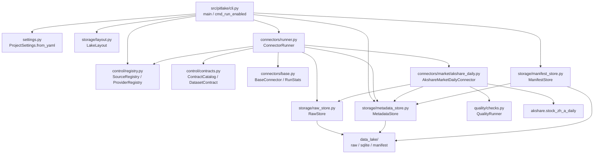

# 当前项目数据流说明

本文是当前项目的“运行说明书”。目标是：即使你是小白，只看这一份 Markdown，也能知道项目从配置、代码、采集、落盘、记账、质量检查到 manifest 发布的实际流程。

当前同步版本：

- 项目阶段：`v0_p0_daily`
- 当前已跑通真实链路：A 股日线 `market_daily_ohlcv`、交易日历 `trading_calendar`
- 当前启用 source：`akshare_market_daily_ohlcv`、`ashare_trading_calendar`
- 当前真实函数：`akshare.stock_zh_a_daily`、`akshare.tool_trade_date_hist_sina`
- 当前贯穿样例：`600000` 在 `2026-04-24` 的日线
- 文档最后同步日期：`2026-04-26`

一句话理解数据流：

```text
配置文件决定采什么
  -> CLI 命令触发采集
  -> ConnectorRunner 装配 source、contract、store
  -> 对应 AkShare Connector 调 AkShare
  -> RawStore 保存原始响应
  -> MetadataStore 写 SQLite 账本
  -> QualityRunner 做质量检查
  -> raw_item_version 保存标准观测项
  -> ManifestStore 发布每日 manifest
  -> 后续研究层按 manifest 读取数据
```

## 1. 先理解几个词

| 词 | 小白解释 | 当前样例 |
| --- | --- | --- |
| provider | 数据供应方、网站、库或厂商 | `akshare` |
| source | 某个具体采集入口 | `akshare_market_daily_ohlcv` |
| logical_dataset | 业务数据集名称，不管来自哪个 source，含义一样的数据归到同一个 dataset | `market_daily_ohlcv` |
| connector | 真正写 Python 代码去拿数据的类 | `AkshareMarketDailyConnector` |
| raw | 数据源返回的原始响应，先完整保存 | AkShare 返回的一行日线 JSON |
| metadata | 元数据账本，记录“采过什么、文件在哪、质量如何” | `pitlake.sqlite` |
| item version | 一条标准观测项的版本记录 | `akshare:600000:2026-04-24` |
| manifest | 某天采集结果的发布清单 | `latest_collection_manifest.json` |
| PIT | point-in-time，只使用“当时已经看见的数据”，避免未来数据泄漏 | `first_seen_at` 记录系统首次看见时间 |

## 2. 当前项目目录分工

| 路径 | 类型 | 作用 |
| --- | --- | --- |
| `config/project.yaml` | 配置 | 项目范围、数据湖路径、运行后端、策略 |
| `config/provider_registry.yaml` | 配置 | 所有数据供应方的治理信息 |
| `config/source_registry.yaml` | 配置 | 所有可采 source 的清单和 connector 映射 |
| `config/dataset_contracts/*.yaml` | 配置 | 每类数据集的字段契约 |
| `src/pitlake/cli.py` | 源码 | 命令行入口，例如 `pitlake run-enabled` |
| `src/pitlake/settings.py` | 源码 | 读取 `project.yaml`，变成 `ProjectSettings` |
| `src/pitlake/control/registry.py` | 源码 | 读取 provider/source registry 并校验 |
| `src/pitlake/control/contracts.py` | 源码 | 读取 dataset contract |
| `src/pitlake/connectors/runner.py` | 源码 | 装配并运行 connector |
| `src/pitlake/connectors/base.py` | 源码 | 所有 connector 的基类 |
| `src/pitlake/connectors/market/akshare_daily.py` | 源码 | 当前真实 A 股日线 connector |
| `src/pitlake/connectors/market/akshare_calendar.py` | 源码 | 当前真实 A 股交易日历 connector |
| `src/pitlake/storage/raw_store.py` | 源码 | 保存 raw 文件和 `.meta.json` |
| `src/pitlake/storage/metadata_store.py` | 源码 | SQLite 表结构和写入逻辑 |
| `src/pitlake/storage/manifest_store.py` | 源码 | 生成每日 manifest |
| `src/pitlake/quality/checks.py` | 源码 | 质量检查 |
| `data_lake/` | 运行产物 | 本地真实数据湖，不提交 Git |

当前数据湖目录：

```text
data_lake/
  collection/
    control/                # 预留：控制面运行产物
    raw_immutable/          # raw 原始响应，只追加保存
    metadata/               # SQLite 元数据账本
    published_manifests/    # 每日 manifest
    quality_reports/        # 预留：质量报告
    staging/                # 预留：中间处理区
    quarantine/             # 预留：坏数据隔离区
    logs/                   # 预留：运行日志
  backups/
    local/                  # 预留：本地备份
```

## 3. 源码架构图

### 3.1 模块关系图



### 3.2 类之间如何嵌套

当前不是复杂的继承树，主要是“装配关系”：

```text
cmd_run_enabled(args)
  settings = ProjectSettings.from_yaml("config/project.yaml")
  LakeLayout(settings).create()
  metadata = MetadataStore(settings)
  metadata.init_schema()
  runner = ConnectorRunner(settings)
    runner.metadata_store = MetadataStore(settings)
    runner.raw_store = RawStore(settings)
      raw_store.layout = LakeLayout(settings)
    runner.contracts = ContractCatalog.load("config/dataset_contracts")
      DatasetContract(...)
    runner.sources = SourceRegistry.load("config/source_registry.yaml")
  runner.run_source(...)
    connector = AkshareMarketDailyConnector(
      settings=settings,
      source_config=source_config,
      contract=DatasetContract("market_daily_ohlcv"),
      raw_store=runner.raw_store,
      metadata_store=runner.metadata_store
    )
```

`AkshareMarketDailyConnector` 继承 `BaseConnector`，所以它自动拥有：

- `self.settings`
- `self.source_config`
- `self.contract`
- `self.raw_store`
- `self.metadata_store`
- `self.source_id`
- `self.provider_id`
- `self.logical_dataset`
- `self.connector_name`

## 4. 四个核心配置输入

当前采集链路主要围绕四类配置文件：

| 配置文件 | 什么时候用 | 当前是否直接参与 `run-enabled` |
| --- | --- | --- |
| `config/project.yaml` | 每次 CLI 运行都会读取 | 是 |
| `config/source_registry.yaml` | `ConnectorRunner` 和 `run-enabled` 会读取 | 是 |
| `config/provider_registry.yaml` | `validate-config` / `init` 校验 source 是否引用合法 provider | 间接参与 |
| `config/dataset_contracts/market_daily_ohlcv.yaml` | `ConnectorRunner` 装载 contract，质量检查要用 | 是 |

注意：`provider_registry.yaml` 在当前 `run-enabled` 执行路径里不是每次都直接读取，但它是治理配置。运行 `pitlake validate-config` 或 `pitlake init` 时会校验 `source_registry.yaml` 里的 `provider_id` 是否存在于 provider registry。

## 5. `project.yaml` 每个字段含义

当前文件：

```yaml
project:
  name: pit-ashare-event-lake
  timezone: Asia/Shanghai
  phase: v0_p0_daily
  scope:
    market: cn_ashare
    frequency: daily
    include_exchanges:
      - SSE
      - SZSE
      - BSE
    exclude:
      - minute_bar
      - level2
      - tick
      - order_book

paths:
  data_lake_root: data_lake
  metadata_db: data_lake/collection/metadata/pitlake.sqlite
  logs_dir: data_lake/collection/logs
  local_backup_dir: data_lake/backups/local

runtime:
  metadata_backend: sqlite
  raw_store: filesystem
  default_trigger_type: manual
  alert_backend: local_report
  credentials_env_file: .env

policy:
  prefer_free_sources: true
  paid_providers_enabled: false
  allow_login_bypass: false
  allow_captcha_bypass: false
  raw_append_only: true
  default_storage_permission: raw_allowed
  unknown_copyright_policy: metadata_only
```

字段解释：

| 字段 | 含义 | 当前值 | 当前代码如何使用 |
| --- | --- | --- | --- |
| `project.name` | 项目名 | `pit-ashare-event-lake` | 目前主要用于说明，不参与逻辑 |
| `project.timezone` | 项目默认时区 | `Asia/Shanghai` | `ProjectSettings.timezone` 保存；时间工具当前固定使用 +08:00 |
| `project.phase` | 当前项目阶段 | `v0_p0_daily` | 文档/治理用，当前代码不分支 |
| `project.scope.market` | 市场范围 | `cn_ashare` | 文档/治理用 |
| `project.scope.frequency` | 频率范围 | `daily` | 文档/治理用，当前只做日频 |
| `project.scope.include_exchanges` | 包含交易所 | `SSE`、`SZSE`、`BSE` | 与 connector 的交易所判断口径一致 |
| `project.scope.exclude` | 明确不做的范围 | 分钟线、Level-2、tick、order book | 防止第一阶段误扩范围 |
| `paths.data_lake_root` | 数据湖根目录 | `data_lake` | `ProjectSettings.data_lake_root`，所有运行产物都在这里 |
| `paths.metadata_db` | SQLite 数据库路径 | `data_lake/collection/metadata/pitlake.sqlite` | `MetadataStore.path` |
| `paths.logs_dir` | 日志目录 | `data_lake/collection/logs` | `LakeLayout.logs_root`，当前预留 |
| `paths.local_backup_dir` | 本地备份目录 | `data_lake/backups/local` | `LakeLayout.backups_root`，当前预留 |
| `runtime.metadata_backend` | 元数据后端 | `sqlite` | `ProjectSettings.metadata_backend`，当前实现只有 SQLite |
| `runtime.raw_store` | raw 存储后端 | `filesystem` | `ProjectSettings.raw_store`，当前实现写本地文件 |
| `runtime.default_trigger_type` | 默认触发方式 | `manual` | 当前 CLI 默认参数也是 `manual` |
| `runtime.alert_backend` | 告警后端 | `local_report` | `ProjectSettings.alert_backend`，当前预留 |
| `runtime.credentials_env_file` | 密钥环境文件 | `.env` | 当前预留；不要把真实密钥写进配置 |
| `policy.prefer_free_sources` | 是否优先免费源 | `true` | `ProjectSettings.prefer_free_sources` |
| `policy.paid_providers_enabled` | 是否启用付费源 | `false` | `ProjectSettings.paid_providers_enabled` |
| `policy.allow_login_bypass` | 是否允许绕登录 | `false` | 治理要求，当前代码不做绕过 |
| `policy.allow_captcha_bypass` | 是否允许绕验证码 | `false` | 治理要求，当前代码不做绕过 |
| `policy.raw_append_only` | raw 是否只追加 | `true` | 当前 `RawStore` 按追加式路径写文件 |
| `policy.default_storage_permission` | 默认存储权限 | `raw_allowed` | 治理默认值 |
| `policy.unknown_copyright_policy` | 版权不清楚时如何处理 | `metadata_only` | 后续新 source 应遵守 |

`ProjectSettings.from_yaml()` 实际读出的字段只有一部分：路径、时区、metadata backend、raw store、alert backend、免费/付费策略。其他字段当前用于文档和治理，后续如果运行逻辑要用，必须同步更新本文档。

## 6. `provider_registry.yaml` 每个字段含义

provider 是“数据供应方”。一个 provider 可以有多个 source。例如 `akshare` provider 下面可以有日线 source、复权因子 source、交易日历 source。

当前 `akshare` provider 样例：

```yaml
- provider_id: akshare
  provider_name: AkShare
  provider_type: open_source_lib
  homepage: https://akshare.akfamily.xyz/
  auth_method: none
  credential_ref: ""
  storage_permission: raw_allowed
  redistribution_scope: internal_only
  cost_model: free
  risk_level: medium
  notes: "Free library for early-stage market data. Use as bootstrap provider, not as the only long-term source."
```

字段解释：

| 字段 | 含义 | 当前样例 | 是否校验必填 |
| --- | --- | --- | --- |
| `provider_id` | provider 唯一 ID，source 用它引用供应方 | `akshare` | 是 |
| `provider_name` | 人能看懂的供应方名称 | `AkShare` | 是 |
| `provider_type` | 供应方类型 | `open_source_lib` | 是 |
| `homepage` | 官网或文档地址 | AkShare 官网 | 否 |
| `auth_method` | 认证方式 | `none` | 是 |
| `credential_ref` | 密钥引用名，不填真实密钥 | 空字符串 | 否 |
| `storage_permission` | 是否允许保存 raw | `raw_allowed` | 是 |
| `redistribution_scope` | 数据再分发范围 | `internal_only` | 否 |
| `cost_model` | 成本模式 | `free` | 否 |
| `risk_level` | 使用风险等级 | `medium` | 否 |
| `notes` | 备注 | Bootstrap provider | 否 |

当前 provider 类型大致含义：

| 类型 | 含义 | 样例 |
| --- | --- | --- |
| `internal` | 项目内部自测数据 | `internal` |
| `open_source_lib` | 开源 Python 库 | `akshare`、`baostock` |
| `public_web` | 公开网页 | `cninfo`、`stooq`、`yahoo_finance` |
| `exchange` | 交易所 | `sse`、`szse`、`bse` |
| `regulator` | 监管机构 | `csrc` |
| `government` | 政府/央行 | `gov_cn`、`pbc` |
| `api_vendor` | API 厂商 | `tushare` |
| `paid_vendor` | 付费终端/数据商 | `wind`、`choice` |

当前校验逻辑在 `ProviderRegistry.validate()`：

- 每个 provider 必须有 `provider_id`、`provider_name`、`provider_type`、`auth_method`、`storage_permission`。
- `provider_id` 不能重复。

## 7. `source_registry.yaml` 每个字段含义

source 是“具体采集入口”。当前启用的是：

```yaml
- source_id: akshare_market_daily_ohlcv
  provider_id: akshare
  logical_dataset: market_daily_ohlcv
  source_type: python_api
  access_method: open_source_lib
  base_url: https://akshare.akfamily.xyz/
  auth_type: none
  credential_ref: ""
  priority: P0
  enabled: true
  implementation_status: active_v0
  adapter_class: pitlake.connectors.market.akshare_daily.AkshareMarketDailyConnector
  allowed_frequency: "daily post-market, max 3 runs/day"
  storage_permission: raw_allowed
  redistribution_policy: internal_only
  default_options:
    start_date: "20260424"
    end_date: "20260424"
    adjust: ""
    symbols:
      - "000001"
      - "600000"
      - "300750"
    limit_symbols: 3
  notes: "Bootstrap source for A-share daily OHLCV using akshare.stock_zh_a_daily. Eastmoney hist source should be added separately as shadow/fallback after local network validation."
```

字段解释：

| 字段 | 含义 | 当前样例 | 是否校验必填 |
| --- | --- | --- | --- |
| `source_id` | source 唯一 ID | `akshare_market_daily_ohlcv` | 是 |
| `provider_id` | 它属于哪个 provider | `akshare` | 是 |
| `logical_dataset` | 产出的业务数据集 | `market_daily_ohlcv` | 是 |
| `source_type` | source 技术类型 | `python_api` | 是 |
| `access_method` | 访问方式 | `open_source_lib` | 是 |
| `base_url` | 官网或接口根地址 | AkShare 官网 | 否 |
| `auth_type` | source 认证方式 | `none` | 是 |
| `credential_ref` | 密钥引用名，不放真实密钥 | 空字符串 | 否 |
| `priority` | 数据优先级 | `P0` | 是 |
| `enabled` | 是否被 `run-enabled` 执行 | `true` | 是 |
| `implementation_status` | 实现状态 | `active_v0` | 否 |
| `adapter_class` | Python connector 类路径 | `pitlake.connectors.market.akshare_daily.AkshareMarketDailyConnector` | 否，但当前运行需要 |
| `allowed_frequency` | 允许采集频率 | 每日盘后，最多 3 次 | 否 |
| `storage_permission` | raw 存储权限 | `raw_allowed` | 否 |
| `redistribution_policy` | 再分发策略 | `internal_only` | 否 |
| `default_options.start_date` | 默认开始日期 | `20260424` | connector 当前需要 |
| `default_options.end_date` | 默认结束日期 | `20260424` | connector 当前需要 |
| `default_options.adjust` | 复权参数 | `""` | 空字符串表示不复权 |
| `default_options.symbols` | 默认股票列表 | `000001`、`600000`、`300750` | connector 当前需要 |
| `default_options.limit_symbols` | 默认最多采几只 | `3` | 防止测试时全市场请求 |
| `notes` | 备注 | 当前 source 的限制和后续计划 | 否 |

`adapter_class` 是最关键的桥梁。`ConnectorRunner.run_source()` 会把字符串：

```text
pitlake.connectors.market.akshare_daily.AkshareMarketDailyConnector
```

拆成：

```text
module = pitlake.connectors.market.akshare_daily
class = AkshareMarketDailyConnector
```

然后用 `importlib.import_module()` 动态导入这个类，并检查它是不是 `BaseConnector` 的子类。

当前 source 状态：

| source_id | logical_dataset | enabled | implementation_status | 当前作用 |
| --- | --- | --- | --- | --- |
| `akshare_market_daily_ohlcv` | `market_daily_ohlcv` | `true` | `active_v0` | 已跑通真实 A 股日线 |
| `ashare_trading_calendar` | `trading_calendar` | `true` | `active_v0` | 已跑通真实 A 股交易日历 |
| `akshare_adjustment_factor` | `adjustment_factor` | `false` | `planned` | 计划接复权因子 |
| `baostock_market_daily_shadow` | `market_daily_ohlcv` | `false` | `planned_shadow` | 计划做日线交叉验证 |
| `ashare_trade_status` | `trade_status` | `false` | `planned` | 计划接停复牌/交易状态 |
| `ashare_price_limit` | `price_limit` | `false` | `planned` | 计划接涨跌停 |
| 公告、政策、商品、全球市场 source | 多个 P0 dataset | `false` | `planned` | 后续逐步接入 |

当前校验逻辑在 `SourceRegistry.validate()`：

- 每个 source 必须有 `source_id`、`provider_id`、`logical_dataset`、`source_type`、`access_method`、`auth_type`、`priority`、`enabled`。
- `source_id` 不能重复。
- `provider_id` 必须存在于 `provider_registry.yaml`。
- `logical_dataset` 必须存在对应 dataset contract。

## 8. `market_daily_ohlcv.yaml` 每个字段含义

dataset contract 是“这类数据长什么样”的约定。当前贯穿样例用：

```yaml
logical_dataset: market_daily_ohlcv
contract_version: 1
description: A-share daily OHLCV observations.
primary_key_fields:
  - provider_id
  - instrument
  - trading_date
required_fields:
  - provider_id
  - source_id
  - instrument
  - exchange
  - trading_date
  - open
  - high
  - low
  - close
  - volume
  - amount
  - first_seen_at
  - raw_uri
  - content_hash
optional_fields:
  - name
  - prev_close
  - turnover
  - vwap
  - source_timestamp
  - quality_status
quality_rules:
  hard:
    - first_seen_at_not_null
    - raw_uri_exists
    - content_hash_not_null
    - instrument_format_valid
    - trading_date_not_null
  soft:
    - row_count_near_recent_median
    - price_fields_non_negative
    - high_greater_equal_low
```

顶层字段解释：

| 字段 | 含义 | 当前使用方式 |
| --- | --- | --- |
| `logical_dataset` | 数据集 ID | source 通过它找到 contract |
| `contract_version` | 契约版本 | 当前记录为 `1`，后续字段变更要升级 |
| `description` | 人类说明 | 文档用 |
| `primary_key_fields` | 业务主键字段 | 当前校验这些字段必须在 required/optional 中声明 |
| `required_fields` | 必填字段 | `QualityRunner.check_required_fields()` 会检查是否非空 |
| `optional_fields` | 可选字段 | 当前不强制检查 |
| `quality_rules.hard` | 硬规则 | 当前只实现了一部分硬检查 |
| `quality_rules.soft` | 软规则 | 当前预留，后续实现 |

`required_fields` 每个字段含义：

| 字段 | 含义 | `600000` 样例 |
| --- | --- | --- |
| `provider_id` | 数据供应方 | `akshare` |
| `source_id` | 具体采集 source | `akshare_market_daily_ohlcv` |
| `instrument` | 标的代码，统一 6 位 | `600000` |
| `exchange` | 交易所 | `SSE` |
| `trading_date` | 交易日 | `2026-04-24` |
| `open` | 开盘价 | `9.53` |
| `high` | 最高价 | `9.62` |
| `low` | 最低价 | `9.43` |
| `close` | 收盘价 | `9.45` |
| `volume` | 成交量 | `84859017` |
| `amount` | 成交额 | `806720096.0` |
| `first_seen_at` | 本系统第一次看到这条记录的时间 | `2026-04-26T11:00:08+08:00` |
| `raw_uri` | 对应 raw 文件在数据湖中的相对路径 | `collection/raw_immutable/...json` |
| `content_hash` | raw 文件内容哈希 | `sha256:9d189a...` |

`optional_fields` 每个字段含义：

| 字段 | 含义 | 当前状态 |
| --- | --- | --- |
| `name` | 股票名称 | 当前 AkShare 日线 connector 未写 |
| `prev_close` | 昨收价 | 当前未写 |
| `turnover` | 换手率 | 当前写入 observed payload，但 contract 里列为可选 |
| `vwap` | 成交均价 | 当前未写 |
| `source_timestamp` | 源头数据时间戳 | 当前未写 |
| `quality_status` | 质量状态 | SQLite `raw_item_version.quality_status` 写 `pass` |

当前 `config/dataset_contracts/` 里还有这些 contract 文件：

```text
adjustment_factor.yaml
announcement_index.yaml
commodity_daily.yaml
global_market_daily.yaml
market_daily_ohlcv.yaml
policy_regulatory_doc.yaml
price_limit.yaml
system_smoke_test.yaml
trade_status.yaml
trading_calendar.yaml
```

但是当前真实采集只启用了 `market_daily_ohlcv`。

## 9. 一条命令如何启动完整流程

当前测试命令：

```powershell
pitlake run-enabled --start-date 20260424 --end-date 20260424 --limit-symbols 3 --manifest-date 2026-04-26
```

命令参数：

| 参数 | 值 | 作用 |
| --- | --- | --- |
| `run-enabled` | 子命令 | 运行所有 `enabled: true` 的 source |
| `--start-date` | `20260424` | 采集开始交易日 |
| `--end-date` | `20260424` | 采集结束交易日 |
| `--limit-symbols` | `3` | 限制股票数量，只取前三只 |
| `--manifest-date` | `2026-04-26` | 本次发布 manifest 的归属日期 |

对应源码入口：

```text
src/pitlake/cli.py
  main()
    build_parser()
    args.func(args)
      cmd_run_enabled(args)
```

`cmd_run_enabled()` 的实际步骤：

```text
1. settings = load_settings(args.config)
2. LakeLayout(settings).create()
3. metadata = MetadataStore(settings)
4. metadata.init_schema()
5. runner = ConnectorRunner(settings)
6. sources = SourceRegistry.load(settings.config_dir).enabled_sources()
7. 对每个 enabled source 调 runner.run_source(...)
8. ManifestStore(settings).generate_daily_manifest(...)
9. print JSON 结果
```

CLI 输出样例：

```json
{
  "status": "success",
  "source_count": 1,
  "results": [
    {
      "status": "success",
      "run_id": "6503bcad-08e3-49a3-bbf6-98e83c8f9a23",
      "source_id": "akshare_market_daily_ohlcv",
      "stats": {
        "request_count": 3,
        "success_count": 3,
        "error_count": 0,
        "new_item_count": 1,
        "updated_item_count": 0,
        "duplicate_count": 2,
        "quarantine_count": 0
      },
      "error_message": null
    }
  ],
  "manifest_path": "collection/published_manifests/dt=2026-04-26/collection_manifest_xxxxxxxxxxxxxxxx.json"
}
```

说明：这个样例里 `new_item_count=1`、`duplicate_count=2`，是因为本地之前已经采过 `600000` 和 `300750`，后续成功运行时它们被判定为重复 item version。

## 10. 完整源码调用链

下面是从命令行到文件落盘的函数级链路：

```text
pitlake run-enabled ...

src/pitlake/cli.py
  main()
    build_parser()
    cmd_run_enabled(args)
      load_settings(args.config)
        ProjectSettings.from_yaml("config/project.yaml")
      LakeLayout(settings).create()
      MetadataStore(settings).init_schema()
      ConnectorRunner(settings).__init__()
        MetadataStore(settings)
        RawStore(settings)
          LakeLayout(settings)
        ContractCatalog.load("config/dataset_contracts")
          DatasetContract.from_payload(...)
        SourceRegistry.load("config/source_registry.yaml")
      SourceRegistry.load(...).enabled_sources()
      ConnectorRunner.run_source(source_id="akshare_market_daily_ohlcv", ...)
        source_config = self.sources.by_id()[source_id]
        contract = self.contracts.by_dataset()["market_daily_ohlcv"]
        load_connector_class(adapter_class)
          importlib.import_module("pitlake.connectors.market.akshare_daily")
          getattr(module, "AkshareMarketDailyConnector")
        connector = AkshareMarketDailyConnector(...)
        MetadataStore.create_run(...)
        connector.collect(run_id, options)
          _resolve_symbols(...)
          _date_to_yyyymmdd(...)
          for symbol in ["000001", "600000", "300750"]:
            _akshare_daily_symbol(symbol)
            akshare.stock_zh_a_daily(...)
            _dataframe_payload(...)
            RawStore.put_json(...)
              RawStore.put_bytes(...)
            MetadataStore.insert_raw_object(...)
            QualityRunner.check_raw_write(...)
            MetadataStore.insert_quality_results(...)
            _persist_rows(...)
              _normalize_record(...)
              QualityRunner.check_required_fields(...)
              MetadataStore.insert_quality_results(...)
              MetadataStore.raw_item_version_exists(...)
              MetadataStore.insert_raw_item_version(...)
        MetadataStore.finish_run(...)
      ManifestStore(settings).generate_daily_manifest(...)
        MetadataStore.fetch_runs_for_day(...)
        MetadataStore.fetch_raw_objects_for_day(...)
        MetadataStore.fetch_quality_for_day(...)
        write_json(collection_manifest_*.json)
        write_json(latest_collection_manifest.json)
        MetadataStore.insert_manifest(...)
```

## 11. 阶段 1：读取配置并生成 settings

输入：

- `config/project.yaml`

源码：

```text
src/pitlake/cli.py
  load_settings(config_path)

src/pitlake/settings.py
  ProjectSettings.from_yaml(config_path)
```

处理：

- 用 `yaml.safe_load()` 读取 YAML。
- 计算 `project_root`。
- 把相对路径转换成绝对路径。
- 生成 `ProjectSettings` dataclass。

输出样例：

```json
{
  "project_root": "C:\\Users\\73498\\YYG\\code\\ai-trading-coach\\external\\pit-ashare-event-lake",
  "config_dir": "C:\\Users\\73498\\YYG\\code\\ai-trading-coach\\external\\pit-ashare-event-lake\\config",
  "data_lake_root": "C:\\Users\\73498\\YYG\\code\\ai-trading-coach\\external\\pit-ashare-event-lake\\data_lake",
  "metadata_db": "C:\\Users\\73498\\YYG\\code\\ai-trading-coach\\external\\pit-ashare-event-lake\\data_lake\\collection\\metadata\\pitlake.sqlite",
  "logs_dir": "C:\\Users\\73498\\YYG\\code\\ai-trading-coach\\external\\pit-ashare-event-lake\\data_lake\\collection\\logs",
  "local_backup_dir": "C:\\Users\\73498\\YYG\\code\\ai-trading-coach\\external\\pit-ashare-event-lake\\data_lake\\backups\\local",
  "timezone": "Asia/Shanghai",
  "metadata_backend": "sqlite",
  "raw_store": "filesystem",
  "alert_backend": "local_report",
  "prefer_free_sources": true,
  "paid_providers_enabled": false
}
```

这一步没有访问外网，也没有采数据。

## 12. 阶段 2：创建数据湖目录和 SQLite 表

输入：

- `ProjectSettings`

源码：

```text
src/pitlake/storage/layout.py
  LakeLayout(settings).create()

src/pitlake/storage/metadata_store.py
  MetadataStore(settings).init_schema()
```

处理：

- `LakeLayout.required_directories()` 列出必须存在的目录。
- `LakeLayout.create()` 创建目录。
- `MetadataStore.init_schema()` 执行 `SCHEMA_SQL`，创建 SQLite 表。

输出文件：

```text
data_lake/
data_lake/collection/
data_lake/collection/raw_immutable/
data_lake/collection/metadata/
data_lake/collection/published_manifests/
data_lake/collection/quality_reports/
data_lake/collection/staging/
data_lake/collection/quarantine/
data_lake/collection/logs/
data_lake/backups/local/
data_lake/collection/metadata/pitlake.sqlite
```

SQLite 当前表：

| 表 | 当前作用 |
| --- | --- |
| `crawl_run` | 每次采集运行的一笔账 |
| `raw_object` | 每个 raw 文件的一笔账 |
| `raw_item_version` | 每条标准观测项的一笔账 |
| `quality_check_result` | 质量检查结果 |
| `collection_manifest` | 已发布 manifest 记录 |
| `source_health` | 预留：source 健康状态 |
| `lineage_event` | 预留：后续研究层 lineage |

## 13. 阶段 3：找出 enabled source

输入：

- `config/source_registry.yaml`

源码：

```text
src/pitlake/control/registry.py
  SourceRegistry.load(config_dir)
  SourceRegistry.enabled_sources()
```

处理：

- 读取 `sources` 列表。
- 过滤 `enabled: true`。

当前输出：

```json
[
  {
    "source_id": "akshare_market_daily_ohlcv",
    "provider_id": "akshare",
    "logical_dataset": "market_daily_ohlcv",
    "enabled": true,
    "adapter_class": "pitlake.connectors.market.akshare_daily.AkshareMarketDailyConnector"
  }
]
```

## 14. 阶段 4：ConnectorRunner 装配运行对象

输入：

- `ProjectSettings`
- `config/source_registry.yaml`
- `config/dataset_contracts/*.yaml`

源码：

```text
src/pitlake/connectors/runner.py
  ConnectorRunner.__init__(settings)
```

处理：

```python
self.settings = settings
self.metadata_store = MetadataStore(settings)
self.raw_store = RawStore(settings)
self.contracts = ContractCatalog.load(settings.config_dir / "dataset_contracts")
self.sources = SourceRegistry.load(settings.config_dir)
```

输出：

- 一个 `ConnectorRunner` 对象。
- 它内部已经有：
  - SQLite 写入器 `MetadataStore`
  - raw 文件写入器 `RawStore`
  - 所有 dataset contract
  - 所有 source 配置

## 15. 阶段 5：开始一轮 source run

输入：

- `source_id="akshare_market_daily_ohlcv"`
- `trigger_type="manual"`
- options：

```json
{
  "start_date": "20260424",
  "end_date": "20260424",
  "limit_symbols": 3,
  "manifest_date": "2026-04-26"
}
```

源码：

```text
src/pitlake/connectors/runner.py
  ConnectorRunner.run_source(...)
```

处理：

1. 找 source 配置：

```python
source_config = self.sources.by_id()[source_id]
```

2. 找 contract：

```python
contract = self.contracts.by_dataset()[source_config["logical_dataset"]]
```

3. 动态加载 connector 类：

```python
connector_cls = load_connector_class(adapter_class)
```

4. 创建 connector：

```python
connector = AkshareMarketDailyConnector(
    settings=settings,
    source_config=source_config,
    contract=contract,
    raw_store=raw_store,
    metadata_store=metadata_store,
)
```

5. 创建运行记录：

```python
run_id = metadata_store.create_run(...)
```

输出样例：

```text
run_id: 2d6e76e7-8767-4b68-ac0f-bd7257c47acb
source_id: akshare_market_daily_ohlcv
provider_id: akshare
logical_dataset: market_daily_ohlcv
connector_name: AkshareMarketDailyConnector
connector_version: 0.1.0
trigger_type: manual
status: running
start_at: 2026-04-26T11:00:06+08:00
```

## 16. 阶段 6：connector 解析股票和日期

输入来源有两层：

1. CLI options 优先。
2. 如果 CLI 没传，就用 `source_registry.yaml` 的 `default_options`。

当前实际输入：

```json
{
  "symbols": ["000001", "600000", "300750"],
  "limit_symbols": 3,
  "start_date": "20260424",
  "end_date": "20260424",
  "adjust": ""
}
```

源码：

```text
src/pitlake/connectors/market/akshare_daily.py
  AkshareMarketDailyConnector.collect(...)
    _resolve_symbols(options, default_options)
    _date_to_yyyymmdd(...)
```

处理：

| 函数 | 输入 | 输出 | 作用 |
| --- | --- | --- | --- |
| `_resolve_symbols()` | options 和 default_options | `["000001", "600000", "300750"]` | 解析股票列表，并按 limit 截断 |
| `_date_to_yyyymmdd()` | `20260424` 或 `2026-04-24` | `20260424` | 校验并压成 AkShare 需要的日期格式 |
| `_akshare_daily_symbol()` | `600000` | `sh600000` | 转成 AkShare 代码 |
| `_plain_symbol()` | `sh600000` 或 `600000` | `600000` | 转回标准 6 位代码 |
| `_exchange_from_symbol()` | `600000` | `SSE` | 按代码前缀判断交易所 |

股票代码转换样例：

| 标准代码 | AkShare 代码 | exchange |
| --- | --- | --- |
| `000001` | `sz000001` | `SZSE` |
| `600000` | `sh600000` | `SSE` |
| `300750` | `sz300750` | `SZSE` |

## 17. 阶段 7：调用 AkShare 拉数据

输入：

```json
{
  "symbol": "sh600000",
  "start_date": "20260424",
  "end_date": "20260424",
  "adjust": ""
}
```

源码：

```text
src/pitlake/connectors/market/akshare_daily.py
  AkshareMarketDailyConnector.collect(...)
    akshare.stock_zh_a_daily(...)
```

实际调用：

```python
df = akshare.stock_zh_a_daily(
    symbol="sh600000",
    start_date="20260424",
    end_date="20260424",
    adjust="",
)
```

输出是一个 DataFrame。`600000` 在 `2026-04-24` 的真实样例行：

```json
{
  "date": "2026-04-24",
  "open": 9.53,
  "high": 9.62,
  "low": 9.43,
  "close": 9.45,
  "volume": 84859017.0,
  "amount": 806720096.0,
  "outstanding_share": 33305838300.0,
  "turnover": 0.0025478721248700714
}
```

这些字段是 AkShare 返回字段，先原样进入 raw，再被标准化。

## 18. 阶段 8：构造 raw payload

输入：

- AkShare DataFrame。
- source 信息。
- 请求参数。

源码：

```text
src/pitlake/connectors/market/akshare_daily.py
  AkshareMarketDailyConnector._dataframe_payload(...)
```

处理：

- `df.to_dict(orient="records")` 把 DataFrame 转为 records。
- `_json_safe()` 把 numpy/pandas 类型转成 JSON 可保存类型。
- 生成统一 raw payload。

输出 raw payload 样例：

```json
{
  "provider_id": "akshare",
  "source_id": "akshare_market_daily_ohlcv",
  "logical_dataset": "market_daily_ohlcv",
  "function": "stock_zh_a_daily",
  "params": {
    "symbol": "sh600000",
    "start_date": "20260424",
    "end_date": "20260424",
    "adjust": ""
  },
  "columns": [
    "date",
    "open",
    "high",
    "low",
    "close",
    "volume",
    "amount",
    "outstanding_share",
    "turnover"
  ],
  "row_count": 1,
  "records": [
    {
      "date": "2026-04-24",
      "open": 9.53,
      "high": 9.62,
      "low": 9.43,
      "close": 9.45,
      "volume": 84859017.0,
      "amount": 806720096.0,
      "outstanding_share": 33305838300.0,
      "turnover": 0.0025478721248700714
    }
  ]
}
```

raw payload 字段解释：

| 字段 | 含义 |
| --- | --- |
| `provider_id` | 数据供应方 |
| `source_id` | 具体 source |
| `logical_dataset` | 业务数据集 |
| `function` | 本次调用的数据源函数 |
| `params.symbol` | 实际请求的数据源代码 |
| `params.start_date` | 请求开始日期 |
| `params.end_date` | 请求结束日期 |
| `params.adjust` | 复权参数，空字符串表示不复权 |
| `columns` | 数据源返回列名 |
| `row_count` | 返回行数 |
| `records` | 数据源返回记录列表 |

`records` 里每个字段含义：

| 字段 | 含义 | 当前样例 |
| --- | --- | --- |
| `date` | 交易日 | `2026-04-24` |
| `open` | 开盘价 | `9.53` |
| `high` | 最高价 | `9.62` |
| `low` | 最低价 | `9.43` |
| `close` | 收盘价 | `9.45` |
| `volume` | 成交量 | `84859017.0` |
| `amount` | 成交额 | `806720096.0` |
| `outstanding_share` | 流通/总股本口径字段，按 AkShare 返回 | `33305838300.0` |
| `turnover` | 换手率 | `0.0025478721248700714` |

## 19. 阶段 9：保存 raw JSON 和 sidecar metadata

输入：

- raw payload。
- source/provider/dataset。
- `run_id`。
- 文件名前缀。
- 请求元数据。

源码：

```text
src/pitlake/storage/raw_store.py
  RawStore.put_json(...)
    stable_json_dumps(payload)
    RawStore.put_bytes(...)
```

`put_bytes()` 做的事：

1. 生成 `stored_at` 和 `first_seen_at`。
2. 对 raw 内容算 `sha256`。
3. 按 source 和日期创建目录。
4. 写 raw JSON。
5. 写同名 `.meta.json`。
6. 返回 `RawWriteResult`。

输出文件路径样例：

```text
data_lake/collection/raw_immutable/
  source=akshare_market_daily_ohlcv/
    dt=2026-04-26/
      akshare_market_daily_ohlcv_600000_20260424_20260424_20260426T110008+0800_9d189a45045f0bdb.json
      akshare_market_daily_ohlcv_600000_20260424_20260424_20260426T110008+0800_9d189a45045f0bdb.json.meta.json
```

文件名结构：

```text
{source_id}_{symbol}_{start_date}_{end_date}_{stored_timestamp}_{content_hash_prefix}.json
```

sidecar `.meta.json` 样例：

```json
{
  "raw_object_id": "06bd9483-b8f2-478d-b0e8-835c2262959a",
  "source_id": "akshare_market_daily_ohlcv",
  "provider_id": "akshare",
  "logical_dataset": "market_daily_ohlcv",
  "run_id": "2d6e76e7-8767-4b68-ac0f-bd7257c47acb",
  "stored_at": "2026-04-26T11:00:08+08:00",
  "first_seen_at": "2026-04-26T11:00:08+08:00",
  "mime_type": "application/json",
  "size_bytes": 525,
  "content_hash": "sha256:9d189a45045f0bdb491287b8bc559686c0f8fd8e16af49407826b4b90ae56636",
  "metadata": {
    "symbol": "600000",
    "api_symbol": "sh600000",
    "start_date": "20260424",
    "end_date": "20260424",
    "adjust": "",
    "akshare_function": "stock_zh_a_daily"
  }
}
```

sidecar 字段解释：

| 字段 | 含义 |
| --- | --- |
| `raw_object_id` | raw 文件唯一 ID |
| `source_id` | 产生这个 raw 的 source |
| `provider_id` | 数据供应方 |
| `logical_dataset` | 业务数据集 |
| `run_id` | 哪次采集运行产生它 |
| `stored_at` | 文件保存时间 |
| `first_seen_at` | 本系统第一次看见这份 raw 的时间 |
| `mime_type` | 文件类型 |
| `size_bytes` | 文件字节数 |
| `content_hash` | raw 内容 hash |
| `metadata.symbol` | 标准股票代码 |
| `metadata.api_symbol` | 实际请求 AkShare 的代码 |
| `metadata.start_date` | 请求开始日期 |
| `metadata.end_date` | 请求结束日期 |
| `metadata.adjust` | 复权参数 |
| `metadata.akshare_function` | 调用的 AkShare 函数 |

`RawWriteResult` 返回给后续流程，字段和 sidecar 基本对应，另外包含本地绝对路径 `storage_path`、`metadata_path` 和数据湖相对路径 `raw_uri`。

## 20. 阶段 10：登记 raw_object

输入：

- `RawWriteResult`
- 请求 hash
- 请求 URL
- 请求参数

源码：

```text
src/pitlake/storage/metadata_store.py
  MetadataStore.insert_raw_object(...)
```

写入 SQLite 表 `raw_object`。样例：

```text
raw_object_id: 06bd9483-b8f2-478d-b0e8-835c2262959a
run_id: 2d6e76e7-8767-4b68-ac0f-bd7257c47acb
source_id: akshare_market_daily_ohlcv
provider_id: akshare
logical_dataset: market_daily_ohlcv
raw_uri: collection/raw_immutable/source=akshare_market_daily_ohlcv/dt=2026-04-26/akshare_market_daily_ohlcv_600000_20260424_20260424_20260426T110008+0800_9d189a45045f0bdb.json
mime_type: application/json
size_bytes: 525
content_hash: sha256:9d189a45045f0bdb491287b8bc559686c0f8fd8e16af49407826b4b90ae56636
request_url: akshare://stock_zh_a_daily
request_params_json: {"adjust":"","api_symbol":"sh600000","end_date":"20260424","start_date":"20260424","symbol":"600000"}
```

这一步的作用：以后不用靠肉眼扫目录找文件，直接查 `raw_object` 就能知道 raw 文件在哪里、来自哪个 run、请求参数是什么。

## 21. 阶段 11：raw 文件质量检查

输入：

- `RawWriteResult`

源码：

```text
src/pitlake/quality/checks.py
  QualityRunner.check_raw_write(raw)

src/pitlake/storage/metadata_store.py
  MetadataStore.insert_quality_results(...)
```

当前检查：

| check_name | 检查什么 | pass 条件 |
| --- | --- | --- |
| `raw_file_exists` | raw 文件是否存在 | `raw.storage_path.exists()` |
| `content_hash_not_null` | hash 是否存在且格式正确 | 以 `sha256:` 开头 |
| `raw_size_positive` | 文件是否非空 | `size_bytes > 0` |

质量结果样例：

```text
check_name: raw_file_exists
check_type: hard
severity: critical
status: pass
expected_value: exists
observed_value: C:\...\data_lake\collection\raw_immutable\source=akshare_market_daily_ohlcv\dt=2026-04-26\akshare_market_daily_ohlcv_600000_20260424_20260424_20260426T110008+0800_9d189a45045f0bdb.json
failed_count: 0
logical_dataset: market_daily_ohlcv
source_id: akshare_market_daily_ohlcv
```

如果任何 critical 检查失败：

- `QualityRunner.has_critical_failures()` 返回 `true`。
- connector 增加 `quarantine_count`。
- 当前 raw 里的行不会继续进入 `raw_item_version`。

## 22. 阶段 12：把数据源记录标准化成 observed payload

输入是 AkShare 原始 record：

```json
{
  "date": "2026-04-24",
  "open": 9.53,
  "high": 9.62,
  "low": 9.43,
  "close": 9.45,
  "volume": 84859017.0,
  "amount": 806720096.0,
  "outstanding_share": 33305838300.0,
  "turnover": 0.0025478721248700714
}
```

源码：

```text
src/pitlake/connectors/market/akshare_daily.py
  AkshareMarketDailyConnector._persist_rows(...)
    AkshareMarketDailyConnector._normalize_record(...)
```

处理：

| 源字段/来源 | 目标字段 | 规则 |
| --- | --- | --- |
| connector 属性 | `provider_id` | `self.provider_id` |
| connector 属性 | `source_id` | `self.source_id` |
| `symbol` | `instrument` | `_plain_symbol(symbol)` |
| `instrument` | `exchange` | `_exchange_from_symbol(instrument)` |
| `record.date` | `trading_date` | 转成字符串 |
| `record.open` | `open` | `_as_float()` |
| `record.close` | `close` | `_as_float()` |
| `record.high` | `high` | `_as_float()` |
| `record.low` | `low` | `_as_float()` |
| `record.volume` | `volume` | `_as_int()` |
| `record.amount` | `amount` | `_as_float()` |
| `record.turnover` | `turnover` | `_as_float()` |
| `record.outstanding_share` | `outstanding_share` | `_as_float()` |
| raw 写入结果 | `first_seen_at` | `raw.first_seen_at` |
| raw 写入结果 | `raw_uri` | `raw.raw_uri` |
| raw 写入结果 | `content_hash` | `raw.content_hash` |

输出 observed payload：

```json
{
  "provider_id": "akshare",
  "source_id": "akshare_market_daily_ohlcv",
  "source_item_key": "akshare:600000:2026-04-24",
  "instrument": "600000",
  "exchange": "SSE",
  "trading_date": "2026-04-24",
  "open": 9.53,
  "close": 9.45,
  "high": 9.62,
  "low": 9.43,
  "volume": 84859017,
  "amount": 806720096.0,
  "turnover": 0.0025478721248700714,
  "outstanding_share": 33305838300.0,
  "first_seen_at": "2026-04-26T11:00:08+08:00",
  "raw_uri": "collection/raw_immutable/source=akshare_market_daily_ohlcv/dt=2026-04-26/akshare_market_daily_ohlcv_600000_20260424_20260424_20260426T110008+0800_9d189a45045f0bdb.json",
  "content_hash": "sha256:9d189a45045f0bdb491287b8bc559686c0f8fd8e16af49407826b4b90ae56636"
}
```

observed payload 字段解释：

| 字段 | 含义 |
| --- | --- |
| `provider_id` | 数据供应方 |
| `source_id` | 具体采集 source |
| `source_item_key` | 源内唯一观测项 key，当前格式 `provider:instrument:trading_date` |
| `instrument` | 标准股票代码 |
| `exchange` | 交易所 |
| `trading_date` | 交易日 |
| `open/high/low/close` | OHLC 价格 |
| `volume` | 成交量，转成整数 |
| `amount` | 成交额 |
| `turnover` | 换手率，可选 |
| `outstanding_share` | AkShare 返回的股本字段，可选 |
| `first_seen_at` | 本系统第一次看见时间 |
| `raw_uri` | 对应 raw 文件相对路径 |
| `content_hash` | 对应 raw 文件 hash |

## 23. 阶段 13：标准观测项质量检查

输入：

- `DatasetContract("market_daily_ohlcv")`
- observed payload

源码：

```text
src/pitlake/quality/checks.py
  QualityRunner.check_required_fields(...)
```

处理：

- 遍历 contract 的 `required_fields`。
- 如果字段不存在、是 `None` 或空字符串，就判定 missing。

当前 `600000` 样例全部必填字段都存在，所以输出：

```text
check_name: required_fields_not_null
check_type: hard
severity: critical
status: pass
expected_value: all required fields present
observed_value:
failed_count: 0
sample_failed_keys: []
logical_dataset: market_daily_ohlcv
source_id: akshare_market_daily_ohlcv
```

如果失败：

- 不写入 `raw_item_version`。
- 当前行计入 `quarantined`。

## 24. 阶段 14：去重并写 raw_item_version

输入：

- observed payload
- raw object 信息
- content hash

源码：

```text
src/pitlake/storage/metadata_store.py
  MetadataStore.raw_item_version_exists(...)
  MetadataStore.insert_raw_item_version(...)
```

去重条件：

```text
logical_dataset + provider_id + source_item_key + content_hash
```

对 `600000` 样例：

```text
logical_dataset = market_daily_ohlcv
provider_id = akshare
source_item_key = akshare:600000:2026-04-24
content_hash = sha256:9d189a45045f0bdb491287b8bc559686c0f8fd8e16af49407826b4b90ae56636
```

如果不存在，写入：

```text
table: raw_item_version
item_version_id: 07b329b4-36e4-4fd0-a0fb-906423c44dee
logical_dataset: market_daily_ohlcv
provider_id: akshare
source_id: akshare_market_daily_ohlcv
source_item_key: akshare:600000:2026-04-24
title: 600000 daily bar 2026-04-24
source_url: akshare://stock_zh_a_daily
first_seen_at: 2026-04-26T11:00:08+08:00
stored_at: 2026-04-26T11:00:08+08:00
raw_object_id: 06bd9483-b8f2-478d-b0e8-835c2262959a
content_hash: sha256:9d189a45045f0bdb491287b8bc559686c0f8fd8e16af49407826b4b90ae56636
quality_status: pass
observed_payload_json: {...上面的 observed payload...}
```

这里 `raw_item_version` 是后续研究层最重要的入口之一。它不是最终特征表，而是“带来源、带时间、可回溯的标准观测项”。

## 25. 阶段 15：结束 run 并写统计

输入：

- `RunStats`

`RunStats` 字段：

| 字段 | 含义 |
| --- | --- |
| `request_count` | 请求次数，当前每只股票一次 |
| `success_count` | 成功请求次数 |
| `error_count` | 请求或处理失败次数 |
| `new_item_count` | 新写入 item version 数 |
| `updated_item_count` | 更新 item 数，当前没有实现更新逻辑 |
| `duplicate_count` | 重复 item version 数 |
| `quarantine_count` | 被隔离/跳过的数据数 |

源码：

```text
src/pitlake/connectors/runner.py
  ConnectorRunner.run_source(...)
    MetadataStore.finish_run(...)
```

状态规则：

| 条件 | status |
| --- | --- |
| `stats.error_count == 0` | `success` |
| `stats.error_count > 0` 且 connector 没整体异常 | `partial` |
| connector 整体抛异常 | `failed` |

本地真实运行中有两类样例：

第一次 `600000` 成功入账所在 run：

```text
run_id: 2d6e76e7-8767-4b68-ac0f-bd7257c47acb
status: partial
request_count: 3
success_count: 2
error_count: 1
new_item_count: 2
duplicate_count: 0
quarantine_count: 0
```

后续一次完整成功 run：

```text
run_id: 6503bcad-08e3-49a3-bbf6-98e83c8f9a23
status: success
request_count: 3
success_count: 3
error_count: 0
new_item_count: 1
duplicate_count: 2
quarantine_count: 0
```

这说明当前本地数据湖里既有调试期失败记录，也有成功记录。manifest 会如实记录这些历史，不会假装没有失败过。

## 26. 阶段 16：生成每日 manifest

输入：

- manifest 日期：`2026-04-26`
- SQLite 当天的 `crawl_run`
- SQLite 当天的 `raw_object`
- SQLite 当天的 `quality_check_result`

源码：

```text
src/pitlake/storage/manifest_store.py
  ManifestStore.generate_daily_manifest(...)
```

处理：

1. `fetch_runs_for_day("2026-04-26")`
2. `fetch_raw_objects_for_day("2026-04-26")`
3. `fetch_quality_for_day("2026-04-26")`
4. 按 `logical_dataset` 汇总 provider、source、raw 数量。
5. 对每个 dataset 的 content hash 列表计算 `content_hash_root`。
6. 生成 manifest JSON。
7. 写两个文件：
   - 一个带 hash 的历史文件。
   - 一个 `latest_collection_manifest.json`。
8. 在 SQLite `collection_manifest` 表登记。

输出路径：

```text
data_lake/collection/published_manifests/
  dt=2026-04-26/
    collection_manifest_{manifest_hash_prefix}.json
    latest_collection_manifest.json
```

manifest 样例：

```json
{
  "manifest_id": "2026-04-26-daily-20260426Txxxxxx+0800",
  "manifest_type": "daily",
  "manifest_date": "2026-04-26",
  "created_at": "2026-04-26Txx:xx:xx+08:00",
  "status": "complete",
  "summary": {
    "run_count": 9,
    "raw_object_count": 18,
    "new_item_count": 4,
    "error_count": 3,
    "quality_check_count": 75
  },
  "datasets": [
    {
      "logical_dataset": "market_daily_ohlcv",
      "providers": ["akshare"],
      "sources": ["akshare_market_daily_ohlcv"],
      "raw_object_count": 17,
      "content_hash_root": "sha256:9a27d25c7fd4623eca6323addacc1b692a8723909723faf0758c9e4deb04f0ff"
    }
  ],
  "runs": [],
  "raw_objects": [],
  "quality_checks": [],
  "manifest_hash": "sha256:...",
  "manifest_path": "collection/published_manifests/dt=2026-04-26/collection_manifest_xxxxxxxxxxxxxxxx.json"
}
```

manifest 顶层字段解释：

| 字段 | 含义 |
| --- | --- |
| `manifest_id` | manifest 唯一 ID |
| `manifest_type` | manifest 类型，当前是 `daily` |
| `manifest_date` | 这份清单对应哪一天 |
| `created_at` | 清单生成时间 |
| `status` | 清单状态，当前由 CLI 根据 source 运行结果设置 |
| `summary` | 汇总统计 |
| `datasets` | 按 dataset 聚合后的列表 |
| `runs` | 当天 `crawl_run` 行快照 |
| `raw_objects` | 当天 `raw_object` 行快照 |
| `quality_checks` | 当天 `quality_check_result` 行快照 |
| `manifest_hash` | manifest 内容 hash |
| `manifest_path` | manifest 在数据湖里的相对路径 |

`summary` 字段解释：

| 字段 | 含义 |
| --- | --- |
| `run_count` | 当天 run 数 |
| `raw_object_count` | 当天 raw 文件数 |
| `new_item_count` | 当天新增 item version 数 |
| `error_count` | 当天非 success/complete 的 run 数 |
| `quality_check_count` | 当天质量检查记录数 |

`datasets` 字段解释：

| 字段 | 含义 |
| --- | --- |
| `logical_dataset` | 数据集 |
| `providers` | 这个 dataset 当天涉及哪些 provider |
| `sources` | 这个 dataset 当天涉及哪些 source |
| `raw_object_count` | 这个 dataset 当天 raw 文件数量 |
| `content_hash_root` | 这个 dataset 当天所有 raw content hash 的聚合 hash |

## 27. 保存文件的作用和重复边界

你看到数据湖里保存了很多文件，疑问是对的：这里确实有一些信息看起来重复。当前设计不是为了无脑多存，而是把同一份采集事实按不同用途保存成三类东西：

```text
raw JSON = 原始证据
SQLite = 查询账本
manifest = 发布清单
```

再加上一个旁路文件：

```text
.meta.json = raw 文件自己的标签
```

### 27.1 哪些文件看起来重复，实际分别负责什么

| 保存内容 | 保存位置 | 主要作用 | 和谁看起来重复 | 为什么当前保留 |
| --- | --- | --- | --- | --- |
| raw JSON | `data_lake/collection/raw_immutable/source=.../dt=.../*.json` | 保存数据源原始返回。AkShare 返回什么，这里就尽量保存什么 | 和 `raw_item_version.observed_payload_json` 都有行情字段 | raw 是原始证据。后续如果字段映射错了、清洗逻辑变了、数据源口径变了，可以回到 raw 重新处理 |
| raw sidecar | `*.json.meta.json` | 保存 raw 文件自己的标签，例如 `raw_object_id`、`run_id`、`stored_at`、`first_seen_at`、`content_hash`、请求参数摘要 | 和 SQLite 的 `raw_object` 表重复 | 它让 raw 文件被单独复制、移动、备份时仍然能看懂来源；如果 SQLite 损坏，也能保留部分追溯信息 |
| SQLite 总账本 | `data_lake/collection/metadata/pitlake.sqlite` | 保存可查询账本，包括 run、raw 文件、质量检查、标准观测项、manifest 记录 | 和 raw sidecar、manifest 都有部分重复 | SQLite 负责查询、去重、统计和生成 manifest。没有它就只能扫目录猜状态 |
| `crawl_run` 表 | SQLite 内 | 记录每次采集运行是否成功、请求几次、失败几次、重复几条 | manifest 里也会复制 run 快照 | 它是运行历史的主账本；manifest 只是某天发布时的快照 |
| `raw_object` 表 | SQLite 内 | 给每个 raw 文件建索引：路径、hash、请求参数、来源 | sidecar 也有 raw 元数据 | SQLite 查询比扫文件快，也是生成 manifest 的依据 |
| `quality_check_result` 表 | SQLite 内 | 保存质量检查结果 | manifest 里也会复制 quality 快照 | SQLite 是完整质量账本；manifest 是发布快照 |
| `raw_item_version` 表 | SQLite 内 | 保存标准化后的可研究观测项，例如 `600000` 的 OHLCV，并关联 raw | raw JSON 里也有原始 record | raw 是源格式，`raw_item_version` 是项目统一格式。后续研究层主要读标准观测项，而不是直接适配每个源的 raw |
| `collection_manifest_*.json` | `data_lake/collection/published_manifests/dt=.../` | 保存某次发布的完整清单快照 | SQLite 里也有 run/raw/quality | manifest 是“当时发布给下游的版本”。即使 SQLite 后面继续变化，这份发布快照也能复现 |
| `latest_collection_manifest.json` | 同一个 `dt=...` 目录 | 固定文件名，指向某天最新 manifest 内容 | 和某个 `collection_manifest_*.json` 内容一样 | 它是快捷入口。下游不用自己找 hash 文件里哪份最新 |

### 27.2 哪些重复是必要的

| 重复关系 | 是否必要 | 原因 |
| --- | --- | --- |
| raw JSON 和 `raw_item_version` 都保存行情字段 | 必要 | 一个是数据源原话，一个是项目标准格式。标准格式可能会变，但 raw 应该保留原始证据 |
| sidecar `.meta.json` 和 `raw_object` 都保存 raw 元数据 | 有用但可优化 | sidecar 让文件独立可读，`raw_object` 让系统可查询。后期如果追求极简，可以考虑关闭 sidecar |
| SQLite 和 manifest 都保存 run/raw/quality 信息 | 必要 | SQLite 是持续变化的账本，manifest 是某天发布快照。研究复现依赖发布快照 |
| `collection_manifest_*.json` 和 `latest_collection_manifest.json` 内容重复 | 可接受 | 一个保历史版本，一个给固定入口。重复很小，换来读取方便 |
| 重复运行同一天同一股票时 raw 可能再次保存 | 当前可接受，后期可优化 | 这记录了“这次运行确实又请求了一次”。后期数据量大时可以做 content hash 去重 |

### 27.3 哪些地方后期可以减重

当前 V0 数据量很小，先保留这些“有用途的重复”是合理的。真正需要减重，是后续接全市场长历史、公告 PDF、网页 HTML、商品和全球市场之后。

可选减重方案：

| 方案 | 怎么做 | 代价 |
| --- | --- | --- |
| raw 内容去重 | 相同 `content_hash` 的 raw 文件只保存一份，不同 run 引用同一个 raw_object | 代码复杂度上升，需要区分“请求事实”和“内容文件” |
| sidecar 可关闭 | 配置一个开关，只依赖 SQLite `raw_object`，不写 `.meta.json` | raw 文件被单独拷走时可读性下降 |
| manifest 瘦身 | manifest 只保存 summary、dataset、run_id、raw_object_id、hash，不复制完整 run/raw/quality 快照 | 下游复现时必须同时依赖 SQLite，manifest 不再完全自包含 |
| 历史 manifest 保留策略 | 只长期保留每日最后一份 manifest，中间调试 manifest 定期清理 | 会减少调试期版本追溯能力 |
| 大文件分层存储 | 小 JSON 本地保存，大 PDF/HTML 后期迁到对象存储或压缩归档 | 需要新增存储后端和备份策略 |

当前判断：

- A 股日线 JSON 很小，不需要急着删。
- 真正最像重复的是 sidecar 和 `raw_object`，但它们解决的是“文件独立可读”和“系统可查询”两个不同问题。
- 如果将来存储压力上来，优先做 raw 内容去重和 manifest 瘦身，而不是删除 raw 或 `raw_item_version`。

## 28. SQLite 表字段含义

### 28.1 `crawl_run`

| 字段 | 含义 |
| --- | --- |
| `run_id` | run 唯一 ID |
| `source_id` | 本次运行的 source |
| `provider_id` | provider |
| `logical_dataset` | 数据集 |
| `connector_name` | connector 类名 |
| `connector_version` | connector 版本 |
| `trigger_type` | 触发方式，例如 `manual` |
| `start_at` | 开始时间 |
| `end_at` | 结束时间 |
| `status` | `running`、`success`、`partial`、`failed` |
| `request_count` | 请求数 |
| `success_count` | 成功数 |
| `error_count` | 错误数 |
| `new_item_count` | 新增 item version 数 |
| `updated_item_count` | 更新 item 数，当前未实现 |
| `duplicate_count` | 重复 item version 数 |
| `quarantine_count` | 隔离/跳过数 |
| `error_message` | 整体异常信息 |
| `code_git_commit` | 代码版本，当前预留 |
| `created_at` | 记录创建时间 |

### 28.2 `raw_object`

| 字段 | 含义 |
| --- | --- |
| `raw_object_id` | raw 文件唯一 ID |
| `run_id` | 哪个 run 生成 |
| `source_id` | 哪个 source 生成 |
| `provider_id` | provider |
| `logical_dataset` | dataset |
| `raw_uri` | 数据湖相对路径 |
| `storage_path` | 本地绝对路径 |
| `metadata_path` | sidecar `.meta.json` 绝对路径 |
| `mime_type` | 文件类型 |
| `size_bytes` | 文件大小 |
| `content_hash` | 文件内容 hash |
| `first_seen_at` | 第一次看见时间 |
| `stored_at` | 保存时间 |
| `status` | 当前一般是 `stored` |
| `request_hash` | 请求参数 hash |
| `request_url` | 请求地址或逻辑 URL |
| `request_params_json` | 请求参数 JSON |

### 28.3 `raw_item_version`

| 字段 | 含义 |
| --- | --- |
| `item_version_id` | item version 唯一 ID |
| `logical_dataset` | dataset |
| `provider_id` | provider |
| `source_id` | source |
| `source_item_key` | 源内观测项 key |
| `title` | 人类可读标题 |
| `source_url` | 源头 URL 或逻辑 URL |
| `source_publish_time` | 源头发布时间，当前日线未写 |
| `source_update_time` | 源头更新时间，当前日线未写 |
| `first_seen_at` | 本系统首次看见时间 |
| `stored_at` | raw 保存时间 |
| `raw_object_id` | 对应 raw 文件 ID |
| `content_hash` | 对应 raw 内容 hash |
| `dedup_hash` | 业务去重 hash |
| `quality_status` | 质量状态 |
| `is_backfilled` | 是否回填 |
| `backfill_reason` | 回填原因 |
| `observed_payload_json` | 标准观测项 JSON |

### 28.4 `quality_check_result`

| 字段 | 含义 |
| --- | --- |
| `check_id` | 检查记录 ID |
| `run_id` | 对应 run |
| `logical_dataset` | dataset |
| `source_id` | source |
| `check_name` | 检查名 |
| `check_type` | 检查类型，例如 `hard` |
| `severity` | 严重程度，例如 `critical` |
| `status` | `pass` 或 `fail` |
| `expected_value` | 期望值 |
| `observed_value` | 实际值 |
| `failed_count` | 失败数量 |
| `sample_failed_keys` | 失败样例 key |
| `created_at` | 检查记录创建时间 |

### 28.5 `collection_manifest`

| 字段 | 含义 |
| --- | --- |
| `manifest_id` | manifest ID |
| `manifest_type` | 类型，当前 `daily` |
| `manifest_date` | 日期 |
| `created_at` | 创建时间 |
| `status` | manifest 状态 |
| `manifest_path` | manifest 路径 |
| `manifest_hash` | manifest hash |
| `run_count` | run 数 |
| `raw_object_count` | raw 文件数 |
| `new_item_count` | 新增 item 数 |
| `error_count` | 错误 run 数 |

### 28.6 预留表

| 表 | 字段 | 当前状态 |
| --- | --- | --- |
| `source_health` | `health_id`、`source_id`、`check_time`、`status`、`freshness_minutes`、`last_success_time`、`last_error_time`、`success_rate_24h`、`new_items_24h`、`notes` | 表已建，当前未写入 |
| `lineage_event` | `lineage_event_id`、`event_time`、`job_name`、`run_id`、`input_datasets`、`output_datasets`、`input_manifest_ids`、`output_manifest_ids`、`source_code_version`、`config_hash`、`status` | 表已建，当前未写入 |

## 29. 贯穿样例：`600000` 从配置到 manifest

下面把 `600000` 这一条真实样例串起来。

### 29.1 配置层

`source_registry.yaml` 决定：

```yaml
source_id: akshare_market_daily_ohlcv
provider_id: akshare
logical_dataset: market_daily_ohlcv
adapter_class: pitlake.connectors.market.akshare_daily.AkshareMarketDailyConnector
default_options:
  symbols:
    - "000001"
    - "600000"
    - "300750"
```

`market_daily_ohlcv.yaml` 决定它必须有：

```text
provider_id, source_id, instrument, exchange, trading_date,
open, high, low, close, volume, amount,
first_seen_at, raw_uri, content_hash
```

### 29.2 请求层

输入：

```text
symbol = 600000
start_date = 20260424
end_date = 20260424
adjust = ""
```

转换：

```text
600000 -> sh600000
600000 -> SSE
```

请求：

```python
akshare.stock_zh_a_daily(
    symbol="sh600000",
    start_date="20260424",
    end_date="20260424",
    adjust="",
)
```

返回：

```json
{
  "date": "2026-04-24",
  "open": 9.53,
  "high": 9.62,
  "low": 9.43,
  "close": 9.45,
  "volume": 84859017.0,
  "amount": 806720096.0,
  "outstanding_share": 33305838300.0,
  "turnover": 0.0025478721248700714
}
```

### 29.3 raw 文件层

保存文件：

```text
collection/raw_immutable/source=akshare_market_daily_ohlcv/dt=2026-04-26/akshare_market_daily_ohlcv_600000_20260424_20260424_20260426T110008+0800_9d189a45045f0bdb.json
```

content hash：

```text
sha256:9d189a45045f0bdb491287b8bc559686c0f8fd8e16af49407826b4b90ae56636
```

### 29.4 raw_object 账本层

写入：

```text
raw_object_id = 06bd9483-b8f2-478d-b0e8-835c2262959a
run_id = 2d6e76e7-8767-4b68-ac0f-bd7257c47acb
request_url = akshare://stock_zh_a_daily
request_params_json = {"adjust":"","api_symbol":"sh600000","end_date":"20260424","start_date":"20260424","symbol":"600000"}
```

### 29.5 observed payload 层

标准化后：

```json
{
  "provider_id": "akshare",
  "source_id": "akshare_market_daily_ohlcv",
  "source_item_key": "akshare:600000:2026-04-24",
  "instrument": "600000",
  "exchange": "SSE",
  "trading_date": "2026-04-24",
  "open": 9.53,
  "close": 9.45,
  "high": 9.62,
  "low": 9.43,
  "volume": 84859017,
  "amount": 806720096.0,
  "turnover": 0.0025478721248700714,
  "outstanding_share": 33305838300.0,
  "first_seen_at": "2026-04-26T11:00:08+08:00",
  "raw_uri": "collection/raw_immutable/source=akshare_market_daily_ohlcv/dt=2026-04-26/akshare_market_daily_ohlcv_600000_20260424_20260424_20260426T110008+0800_9d189a45045f0bdb.json",
  "content_hash": "sha256:9d189a45045f0bdb491287b8bc559686c0f8fd8e16af49407826b4b90ae56636"
}
```

### 29.6 raw_item_version 层

写入：

```text
item_version_id = 07b329b4-36e4-4fd0-a0fb-906423c44dee
source_item_key = akshare:600000:2026-04-24
title = 600000 daily bar 2026-04-24
quality_status = pass
```

### 29.7 manifest 层

`latest_collection_manifest.json` 会把当天：

- 哪些 run 跑过；
- 哪些 raw 文件保存了；
- 哪些质量检查通过或失败；
- 哪些 dataset 有新数据；

全部放到一个 JSON 清单里。

## 30. 当前真实运行情况

本地 `2026-04-26` manifest 当前不是“干净生产日”，它包含 smoke test 和调试失败记录。当前样例统计：

```json
{
  "run_count": 9,
  "raw_object_count": 18,
  "new_item_count": 4,
  "error_count": 3,
  "quality_check_count": 75
}
```

当前 dataset 汇总：

```json
[
  {
    "logical_dataset": "market_daily_ohlcv",
    "providers": ["akshare"],
    "sources": ["akshare_market_daily_ohlcv"],
    "raw_object_count": 17
  },
  {
    "logical_dataset": "system_smoke_test",
    "providers": ["internal"],
    "sources": ["pitlake_smoke_test"],
    "raw_object_count": 1
  }
]
```

当前已经真实写入的三条 A 股日线 item version：

| source_item_key | open | high | low | close | volume | amount | 状态 |
| --- | --- | --- | --- | --- | --- | --- | --- |
| `akshare:600000:2026-04-24` | `9.53` | `9.62` | `9.43` | `9.45` | `84859017` | `806720096.0` | `pass` |
| `akshare:300750:2026-04-24` | `442.0` | `448.45` | `438.0` | `444.9` | `39542497` | `17517374359.0` | `pass` |
| `akshare:000001:2026-04-24` | `10.98` | `11.03` | `10.92` | `11.0` | `58271012` | `639781173.0` | `pass` |

## 31. 后续研究层应该怎么读取

当前仓库只实现采集层。后续研究层不要直接“猜最新文件”，推荐这样读：

```text
1. 选择 manifest 日期，例如 2026-04-26。
2. 读取 data_lake/collection/published_manifests/dt=2026-04-26/latest_collection_manifest.json。
3. 检查 manifest.status、summary.error_count、datasets。
4. 用 manifest 里的 raw_objects 或 SQLite 的 raw_item_version 找到数据。
5. 需要回溯时，通过 raw_uri 打开原始 raw JSON。
6. 再进入事件抽取、特征工程、模型训练、回测。
```

这样做的好处：

- 知道数据是哪天采到的。
- 知道来自哪个 source/provider。
- 知道当时质量检查是否通过。
- 能回到原始 raw 文件排查问题。
- 避免误用未来才出现的数据。

## 32. 新增 source 时这份文档如何同步更新

以后只要架构、配置、字段或数据流变化，这份文档必须同步更新。具体规则：

| 发生变化 | 必须更新本文档哪里 |
| --- | --- |
| 新增 provider | 更新 `provider_registry.yaml` 字段样例和 provider 说明 |
| 新增 source | 更新 `source_registry.yaml` source 状态表、调用链和样例 |
| 新增 dataset contract | 更新 contract 说明、必填字段和质量检查说明 |
| 改 CLI 参数 | 更新命令说明和 CLI 调用链 |
| 改 connector 类名或路径 | 更新源码架构图、`adapter_class` 和调用链 |
| 改 raw 文件格式 | 更新 raw payload、sidecar、文件字段说明 |
| 改 SQLite schema | 更新 SQLite 表字段说明 |
| 改 manifest 格式 | 更新 manifest 字段说明 |
| 新增质量检查 | 更新质量检查阶段和 `quality_check_result` 样例 |
| 新增研究层读取逻辑 | 更新“后续研究层怎么读取” |

推荐每次开发完成后做三件事：

```powershell
pitlake validate-config
pitlake run-enabled --start-date 20260424 --end-date 20260424 --limit-symbols 3 --manifest-date 2026-04-26
git diff --check -- docs/project_data_flow_zh.md
```

如果运行样例变了，也要同步更新本文档里的贯穿样例，避免文档和代码脱节。
